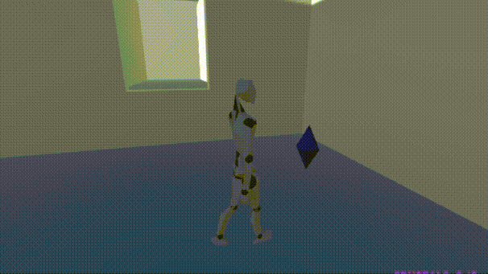
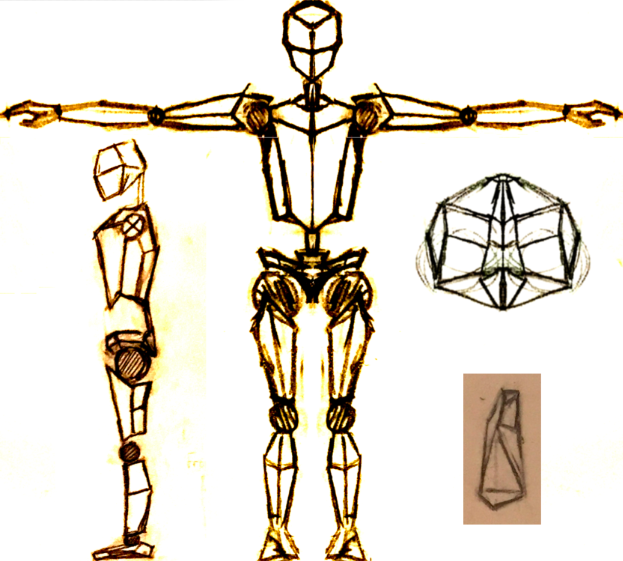
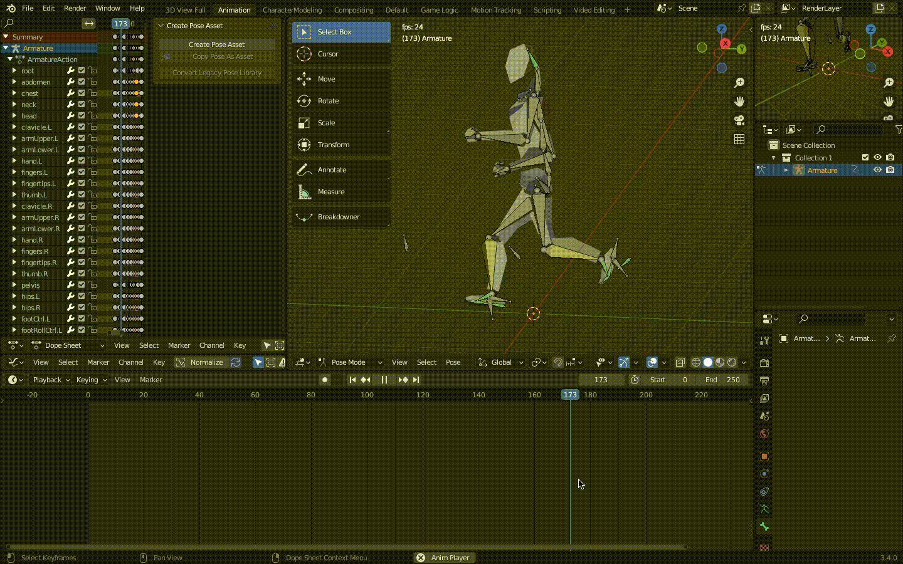

# ManWalking: Ultra-Basic Platformer Demo

Inspired by a (now-disappeared) video that [this one](https://www.youtube.com/watch?v=S36CH4cbW1A) includes first in its compilation, I wanted to know how I would go about making a basic 3D platformer. Steps turned out to be:

- Design a character model similar to that in the video, implement it in Blender

- Animate the character

- Create other objects directly in Unity (keys, crystals, walls in top video)

- Control the player and the behavior of objects by attaching C# scripts with access to object properties
